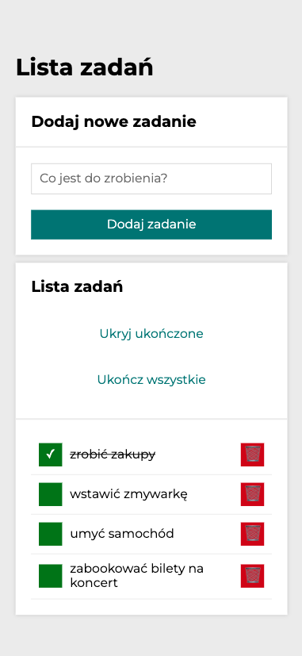

# To do list
### **Your daily task assistant**

**To do list** is a simple task assistant application. Whenever you go to do the shopping or get some things to done my app is at your side. It's very simple and versatile in use. You can find below in a few quick steps how to apply its full potential. The construction of this app is based on JavaScript array and other JS ES6 features. For sure this repository will be developed in the nearest future, so don't bother yourself to search other "to-do-lists" and visit us soon to check out the updates.

### **[To do list - App link](https://traczoskar.github.io/to_do_list/)**

## How to use

**1.** Input the name of your task or shopping item that you want to add to your list.

**2.** *"Click"* adding the task button on the right side of the input - "*Dodaj zadanie*".

**3.** The task will show up on the list below.

**4.** Now you can use toggle the task to be *"done"* using the green button on its left side. The task will be crossed off and the button will get tick icon.

**5.** You can easily delete your task using the red *"remove"* button with waste bucket icon on the right side.

**6.** After you add a task, there will be able 2 additional options: "Hide/Show tasks that are done" and "Finish all tasks".

**7.** Use one of those options to manage your list easier.

## Features

- Simple, transparent and minimalistic design
- Easy and intuitive to use
- Quick response to every action that user takes with the buttons
- Versatile and universal application
- Responsive on any device due to media queries
- Buttons are interactive and its appearance depends of actual state

### Below you can see how the app looks in the mobile view.

## Used technologies and conventions

- **BEM** convention
- **camelCase** class and functions naming
- **CSS:** (normalize.css) applied
- **CSS:** (border-box: box-sizing) applied
- **CSS:** Grid
- **CSS:** Transform and transitions
- **JS ES6** Features
- **JS:** Array, methods, spread syntax, merge
- **JS:** Objects
- **JS:** Arrow functions
- **JS:** Immutability

## Thanks for visiting my repository.
I hope this application will be helpful also for You. Please, feel free to use it.